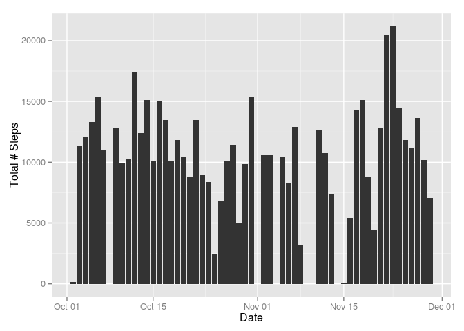
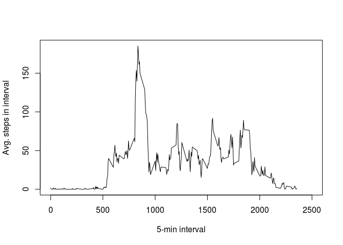
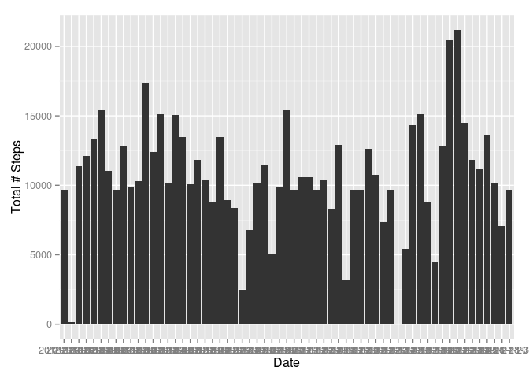
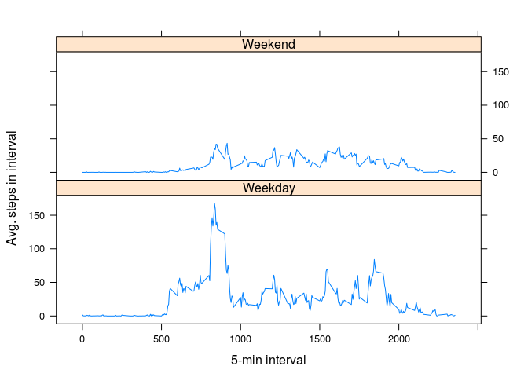

# Reproducible Research: Peer Assessment 1
Paul Fekete  


## Loading and preprocessing the data

The data is stored in the activity.zip file which has been downloaded from https://d396qusza40orc.cloudfront.net/repdata%2Fdata%2Factivity.zip

The data is unzipped into the 'activity_data' directory.

```r
if (!dir.exists("activity_data")) {
  dir.create("activity_data")
  unzip("activity.zip",exdir="activity_data")
}
```

The file 'activity.csv' is read from the activity_data directory and stored into an object called actData.


```r
actData <- read.csv("./activity_data/activity.csv",
                    colClasses=c("numeric",
                                 "character",
                                 "numeric"))
rawActData <- actData
```

The data is preprocessed to remove any rows with NAs in the variables.


```r
actData <- actData[!is.na(actData$steps),]
actData <- actData[!is.na(actData$date),]
actData <- actData[!is.na(actData$interval),]
```

## What is mean total number of steps taken per day?

Firstly, the number of steps are added up for each day. This is stored in an object called 'actData_byDay'.


```r
## 1. Add up number of steps for each day
library(lubridate)
library(dplyr)
```

```
## 
## Attaching package: 'dplyr'
## 
## The following objects are masked from 'package:lubridate':
## 
##     intersect, setdiff, union
## 
## The following objects are masked from 'package:stats':
## 
##     filter, lag
## 
## The following objects are masked from 'package:base':
## 
##     intersect, setdiff, setequal, union
```

```r
tmp <- data.frame(actData)
tmp <- data.frame(steps=actData$steps,
        date=parse_date_time(actData$date,"%y-%m-%d"))

actData_byDay <- group_by(tmp,date)
actData_byDay <- summarise(actData_byDay,
                           totalStepsPerDay = sum(steps),
                           numOfRowsPerDay = n_distinct(steps))
```

A histogram is constructed to show the total steps per day.


```r
## 2. Make a histogram of the total number of
##    steps taken per day.
library(ggplot2)
tmp2_forHist <- mutate(actData_byDay,
               numOfRowsPerDay=NULL)
stepsHist <- qplot(tmp2_forHist,
                   geom="histogram",
                   x=tmp2_forHist$date,
                   y=as.numeric(tmp2_forHist$totalStepsPerDay),
                   stat="identity",
                   ylab="Total # Steps",
                   xlab="Date")
```

This is the histogram:

 

The mean and median of the total number of steps taken per day are calculated.

```r
meanStepsTakenPerDay = mean(actData_byDay$totalStepsPerDay)
medianStepsTakenPerDay = median(actData_byDay$totalStepsPerDay)
```

The mean of the total number of steps taken per day is 10766.19.

The median of the total number of steps taken per day is 10765.

## What is the average daily activity pattern?

Create a time series plot of the 5-minute interval and the average number of steps taken, averaged across all days.

In order to do this, the number of steps are added up for each 5 minute interval across all days. Therefore there is a total number for each interval and not for each day.


```r
# get number of days covered in the data
firstDay = min(levels(factor(actData[,"date"])))
lastDay = max(levels(factor(actData[,"date"])))
numDays <- as.POSIXlt(lastDay) - as.POSIXlt(firstDay)
numDays <- round(as.numeric(numDays) + 1)

actData5minInt <- group_by(actData,interval)
actData5minInt <- summarise(actData5minInt,
                            totalSteps = sum(steps),
                            meanSteps = sum(steps)/numDays)

# plot the time series
fiveMinIntPlot <- plot(x=actData5minInt$interval,
                       y=actData5minInt$meanSteps,
                       type="l",
                       xlab="5-min interval",
                       ylab="Avg. steps in interval",
                       xlim=c(0,2500))
```

 

From the list of 5 minute intervals the maximum average per interval is extracted.

```r
d <- actData5minInt[actData5minInt$meanSteps>184,]["interval"][1,1]
intervalWithMaxAverage <- d[[1,1]]
```

The interval with the maximum average number of steps is 835.


## Imputing missing values
The total number of missing values in the dataset is calculated.

```r
tmp <- rawActData[(is.na(rawActData$steps)) |
                  (is.na(rawActData$date)) |
                  (is.na(rawActData$interval)),]

numberOfRowsWithNA <- length(tmp[,"steps"])
```

There were 2304 missing in the original data set.


The following strategy is used to fill in all the missing values in the dataset:

1. Get the average for each given time interval from the 'actData5minInt' object.
2. Store this in a list.
3. Fill in the missing values using corresponding time intervals from the list.


```r
tmp2 <- tmp
for (i in 1:length(tmp2[,1])) {
  tmp2[i,"steps"]<-round(actData5minInt[actData5minInt$interval==tmp2[i,"interval"],][,"meanSteps"][[1,1]])
}

tmp<-rawActData
for (i in 1:length(tmp[,1])) {
  if (is.na(tmp[i,"steps"])) {
    tmp[i,"steps"]<-round(actData5minInt[actData5minInt$interval==tmp[i,"interval"],][,"meanSteps"][[1,1]])
  }
}
imputedData <- tmp

head(imputedData)
```

```
##   steps       date interval
## 1     2 2012-10-01        0
## 2     0 2012-10-01        5
## 3     0 2012-10-01       10
## 4     0 2012-10-01       15
## 5     0 2012-10-01       20
## 6     2 2012-10-01       25
```

```r
tail(imputedData)
```

```
##       steps       date interval
## 17563     2 2012-11-30     2330
## 17564     4 2012-11-30     2335
## 17565     3 2012-11-30     2340
## 17566     1 2012-11-30     2345
## 17567     0 2012-11-30     2350
## 17568     1 2012-11-30     2355
```

This imputed data is used to create a new data set with the total steps per day calculated.


```r
impDataSet <- group_by(imputedData,
                       date)
impDataSet <- summarise(impDataSet,
                        totalStepsPerDay=sum(steps))
```

This can now be used to make a histogram where missing values have been inserted.


```r
stepsHist_imputed <- qplot(impDataSet,
                           geom="histogram",
                           x=impDataSet$date,
                           y=as.numeric(impDataSet$totalStepsPerDay),
                           stat="identity",
                           ylab="Total # Steps",
                           xlab="Date")

stepsHist_imputed
```

 

We can also calculate the mean and median of the total number of steps taken per day.

```r
meanImputedTotalStepsPerDay = mean(impDataSet$totalStepsPerDay)
medianImputedTotalStepsPerDay = median(impDataSet$totalStepsPerDay)
```

Using the imputed data, the mean of the total number of steps taken per day is 10622.03.

Using the imputed data, the median of the total number of steps taken per day is 10395.

Comparing results, we can see that the second histogram has few columns missing from the histogram. This means days where zero steps are reported are removed, since it is unlikely a person would not taken any steps during any single day.

## Are there differences in activity patterns between weekdays and weekends?

A new factor variable is added to the dataset. This variable records either 'weekday' or 'weekend' depending on the corresponding date value.

```r
impDataSet_withWeekdayFactor <- mutate(impDataSet,
                                       weekday=weekdays(parse_date_time(date,"%Y-%m-%d")))
impDataSet_withWeekdayFactor <- mutate(impDataSet_withWeekdayFactor,
                                       weekpart=ifelse((weekday=="Saturday" | weekday=="Sunday"),
                                                         "Weekend",
                                                         "Weekday"))

imputedData_withWeekdayFactor <- mutate(imputedData,
                                        weekday=weekdays(parse_date_time(date,"%Y-%m-%d")))
imputedData_withWeekdayFactor <- mutate(imputedData_withWeekdayFactor,
                                        weekpart=ifelse((weekday=="Saturday" | weekday=="Sunday"),
                                                        "Weekend",
                                                        "Weekday"))
```

Create a panel plot showing a time series plot of the 5-minute interval and the average number of steps taken, averaged across all weekday days or weekend days.


```r
# get number of days covered in the data
firstDay = min(levels(factor(imputedData_withWeekdayFactor[,"date"])))
lastDay = max(levels(factor(imputedData_withWeekdayFactor[,"date"])))
numDays <- as.POSIXlt(lastDay) - as.POSIXlt(firstDay)
numDays <- round(as.numeric(numDays) + 1)

imputedData_withWeekdayFactor5minInt <- group_by(imputedData_withWeekdayFactor,interval,weekpart)
imputedData_withWeekdayFactor5minInt <- summarise(imputedData_withWeekdayFactor5minInt,
                                                  totalSteps = sum(steps),
                                                  meanSteps = sum(steps)/numDays)


library(lattice)
panelPlot <- xyplot(meanSteps ~ interval | weekpart, 
                      data = imputedData_withWeekdayFactor5minInt,
                      type = "l",
                      xlab = "5-min interval",
                      ylab = "Avg. steps in interval",
                      layout=c(1,2))

panelPlot
```

 

